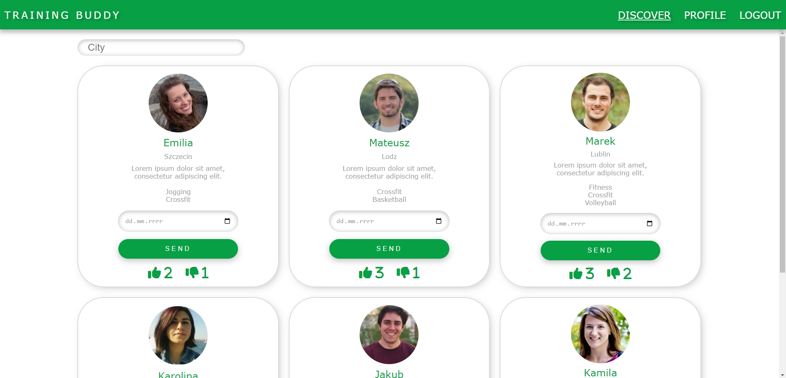
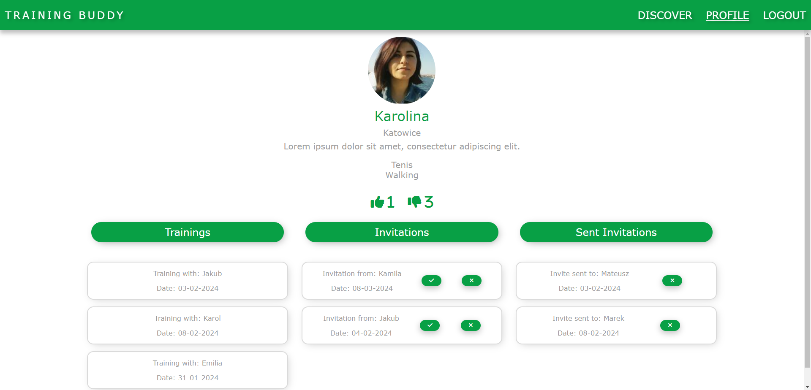
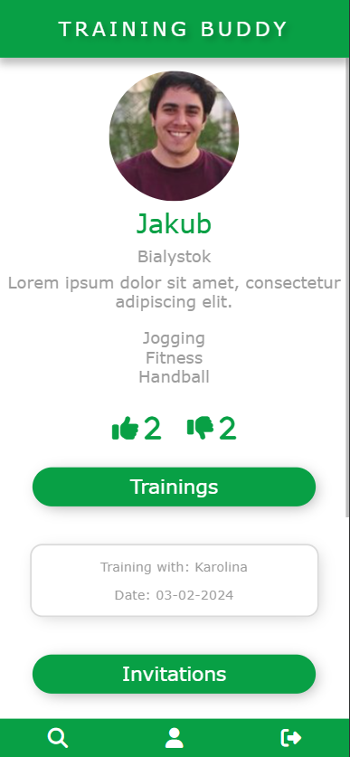
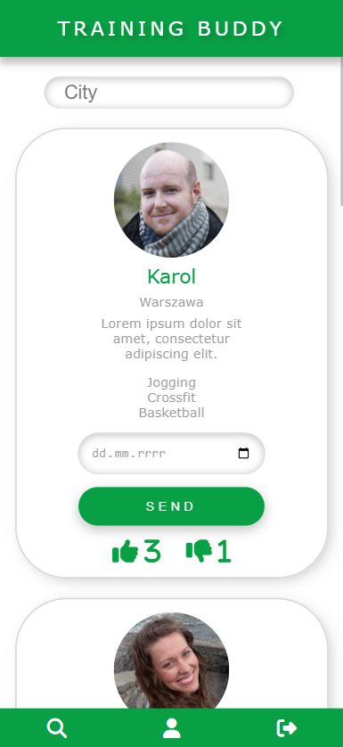

# Training Buddy

> Web application that helps connect people with similar sport inerests

## Table of Contents

- [About](#about)
- [Technologies](#technologies)
- [Features](#features)
- [Screenchots](#screenshots)
- [Instructions](#instructions)

## About

This web application allows you to create an account and find people for training togehter

## Technologies

### Frontend:

- HTML
- CSS
- JavaScript

### Backend:

- PHP

### Database: 

- PostgreSQL

### Other technologies:

- Docker
- NGINX

## Features

- Users can find the potential training partner in the discover section
- Users can invite each other to training
- Users can rate each other

## Screenshots

## Instructions

**To launch this project you need to open Docker Application**

1. Download project
2. Run `docker-compose up` in main directory
3. After that run website in your browser and type `localhost:8080` in searchbar